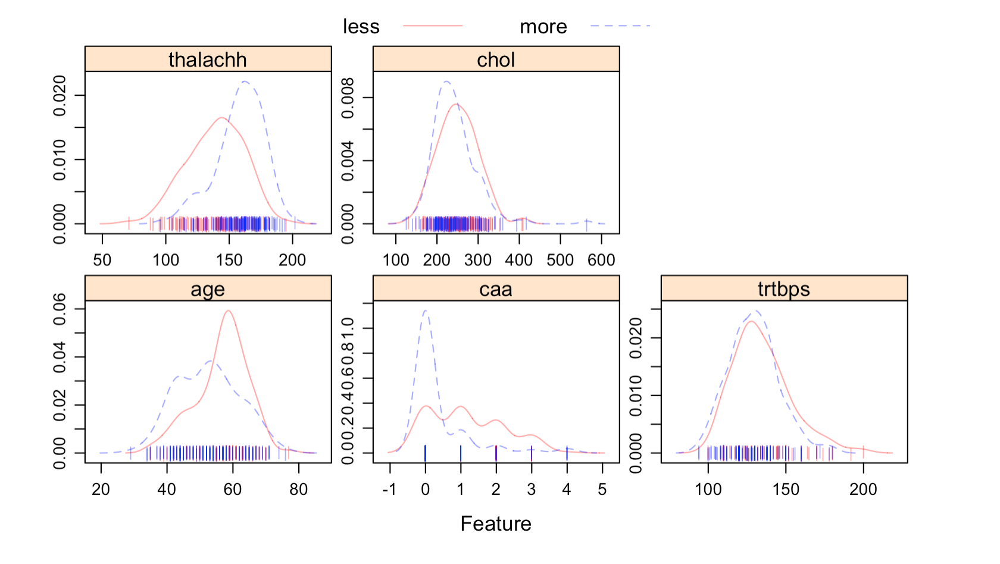

```{r setup, include=FALSE}
library(tidyverse)
library(viridis)
library(mlbench)
library(ISLR)
library(caret)
library(e1071)
library(kernlab)
library(factoextra)
library(gridExtra)
library(corrplot)
library(RColorBrewer) 
library(gplots)
library(jpeg)
library(MASS)
library(pROC)
library(klaR)
library(pdp)
library(vip)
library(AppliedPredictiveModeling)
library(mgcv)
library(nlme)
library(rpart)
library(rpart.plot)
library(party)
library(partykit)
library(randomForest)
library(ranger)
library(gbm)
library(ggplot2)
library(ggpubr)
```


\newpage 

# I.  Introduction  

## 1.1 Data Source 

The dataset used for this research purpose was the Public Health Dataset and it is dating from 1988 and consists of four databases: Cleveland, Hungary, Switzerland, and Long Beach V. 

## 1.2 Motivation  

Heart attack, also be known as myocardial infarction or coronary thrombosis, refers to the necrosis of part of the heart muscle due to lack of oxygen. It can be complicated by arrhythmia, shock or heart failure, which is life-threatening and is currently the most critical cardiac emergency. An early diagnosis of such a disease is a crucial task for many health care providers to prevent their patients for such a disease and to save patients’ lives.  

In this report, a comparative analysis of different classifiers was performed for the classification of the Heart Attack dataset in order to correctly classify and or predict Heart Attack cases with minimal attributes. 

## 1.3 Data Preprocessing and Cleaning 

Our final dataset contains 303 observations and 11 attributes, including demographic values, such as age and gender, 8 attributes referring to patients’ cardiovascular-related symptoms, as well as a predicted attribute. We applied package `tydiverse` to clean the data and transform data types as factor for analysis convience, and package `caret` to partitioning data. We set 70% of the data to be train data and the rest of 30% to be test data.  
The predictors involving in this dataset are illustrated as below: 
  * `age`: Age of the patient.\
  * `sex`: Sex of the patient.\
  * `cp`: Chest pain type (3 = typical angina; 2 = atypical angina; 1 = non-anginal pain; 0 =  asymptomatic).\
  * `trtbps`: resting blood pressure (in mm Hg).\
  * `chol`: serum cholestoral in mg/dl.\
  * `fbs`: fasting blood sugar > 120 mg/dl (1 = true; 0 = false).\
  * `restecg`: resting electrocardiographic results (0 = normal; 1 = having ST-T wave abnormality; 2 = showing probable or definite left ventricular hypertrophy by Estes’ criteria).\
  * `thalachh`: maximum heart rate achieved.\
  * `exng`: exercise induced angina (1 = yes; 0 = no).\
  * `oldpeak`: ST depression induced by exercise relative to rest.\ 
  * `caa`: number of major vessels (0-3).\
  * `output`: less = less chance of heart attack; more = more chance of heart attack.\
Note that this dataset does not contain any null value, so we do not apply any method to impute the missing value.

```{r, echo=FALSE}
heartattack = read_csv("heartattack.csv") %>%
              mutate(
                sex = factor(sex,ordered=TRUE),
                exng = factor(exng,ordered = TRUE),
                cp = factor(cp,ordered = TRUE),
                fbs = factor(fbs,ordered = TRUE),
                restecg = factor(restecg,ordered = TRUE),
                output = factor(case_when(output== 0 ~ "less",
                                   output == 1 ~ "more")),
                output = fct_relevel(output, "less")
              )%>%
  na.omit()%>%
  dplyr::select(-thall, -slp)
skimr::skim_without_charts(heartattack)
```

## 2.  Exploratory Analysis/ Visualization  

In this section, we used the function `featureplot()`  to visualize the continuous variables and the only binary predictor `output` in the training set. As the feature plots (see Figure 1) shown, those continuous predictors are approximately normal. 



We also used the function `boxplot()` to visualize the distribution of this dataset(see Figure 2).We note that some predictors of this dataset is not perfectly distributed. For example, `chest pain type`, `resting electrocardiographic results`, and `exercise induced angina` group have relative higher percentage in `more` result, so we assume that those factors will be more important in the model predictions. While `fasting blood sugar > 120 mg/dl` approximately has the same percentages in `more` and `less` results and we assume that `fasting blood sugar > 120 mg/dl` has less impact in the model classification.


