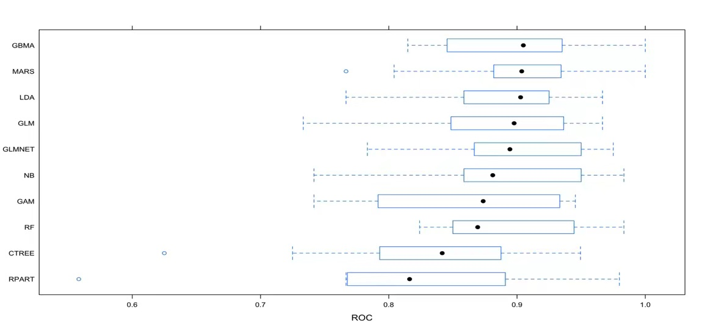

3. Modeling

3.1 Predictors

Our response variable is a category variable. We set it as 0 when the output is less chance of heart attack and 1 when the out is more chance.

Here we elucidate the predictors: 
**age**: age in years；
**sex**: sex of patients;
**cp**: chest pain type;
**trestbps**: resting blood pressure;
**chol**: serum cholestoral in mg/dl;
**fbs**: fasting blood sugar > 120 mg/dl;
**restecg**: resting electrocardiographic results;
**thalach**: maximum heart rate achieved;
**exang**: exercise induced angina;
**caa**: number of major vessels (0-3) colored by flourosopy
**oldpeak**: ST depression induced by exercise relative to rest.

3.2 Used Techniques

At first, we use common models, generalized linear regression, with/without penalization (GLM and GLMNET), and GAM. Then we try more flexible models, like MARS. Since this analysis mainly focuses on classification, LDA, tree method (CTREE and RPART) and NB,RF, GBMA, Support Vector, ICE are also included to see whether there is a better performance. Specifically, GlM and GLMNET are parametric model which make assumption on independence on errors and distribution. The rest are all non-parametric models.

3.3 Tuning Parameters

Most of our models require us to consider tuning parameters. We select them by following the procedure: Initially, we utilize a wide range and coarse search pattern; After finding approximate ranges which show the best cross-validation performance for the parameters, we then search parameter patterns by narrowing the range and by decreasing the step within each parameter sequence to reach more density. For some specific method like MARS, the range of tuning parameters (degree of features and number of terms) are select considering model definition. The best tuning parameters given by the cross-validation is: 
**GLMNET**:alpha = 0', lamba = 0.4936728; 
**MARS**:nprune = 5, degree = 1; 
**CTREE**:minicriterion = 0.6321206; 
**RPART**:cp = 0.005494; 
**NB**:usekernel = TRUE, adjust = 2.1; 
**RF**:mtry = 1, splitrule = gini, min.node.size = 2;
**GBMA**: n.trees = 4000, interaction.depth = 1, shrinkage = 0.002, n.minobsinnode = 1.

3.4 Training Performance

We evaluated all models’ performance by using 10-folds cross-validation on the training set. Considering that repeated-CV takes a long time for NB computation, we decide not to use it. The cross-validation results are shown below:

All models fit data quite well, with all ROC larger than 0.8. And it is notable that GBMA and MARS show the best performance, whose ROCs are over 0.9. Both tree methods report comparatively low roc since their CV results have more variabililty. We also find that GAM model doesn't fit the data as well as other flexible models and our assumption is that the CV result range is too wide, affecting its performance.
